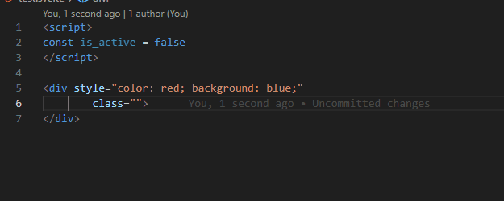

# CSS Lube

## Introduction
The landscape of CSS paradigms has seen a constant evolution, marked by the rise of popular CSS-In-JS libraries like styled-components and emotion.  
However, in recent times, there has been a notable shift in focus towards CSS libraries that emphasize "zero-runtime" approaches, such as Tailwind CSS and vanilla-extract.  
These libraries are garnering attention for their promise of improved performance.  
However, CSS Lube challenges the notion of relying solely on build time for achieving optimal performance.  

## What is CSS Lube?
CSS Lube is Highly-optimized CSS Interpreter.
It is makes improved your developer experience by implement any designs directly in markup and immediately reflect feedback.
In addition, CSS Lube parses HTML documents at runtime and render styles, so it can completely replace style files that become bloated whenever updated with a 6,323 byte(2,709 byte on gzip) js file.
Looking at the PageSpeed Insights score table below, you'll be able to guess the performance level of the CSS Lube, even considering the margin of error.
[Benchmark - CSS Lube](https://artxe2.github.io/css-lube/ref/benchmark)


## What's the difference?
One of the key things about lube is that it's a zero-buildtime css Luberary.
More than half of the CSS Lube code is the part that defines shorthand, and the actual logic is less than 3kb.
With syntax and various optimizations that can be completely converted to css with just a simple string replacement, CSS Lube was able to achieve the same level of performance as zero-runtime css in js with this small bundle size.

#### VS. Traditional way
- Utility-first CSS is much better in terms of maintenance and developer experience than semantic CSS.

#### VS. Existing CSS In JS libraries
- This is enough. Css Lube is incredibly fast.

#### VS. Tailwind CSS
- There are no additional learning curves except for a few syntax and shorthand.
- All styles are available without write custom, and all changes are immediately reflected in the development phase.
- You can easily switch to dark mode using basic media queries.
- Build time is much faster because no additional steps are required to build.

#### VS. vanilla-extract
- It is much more productive using various convenient shorthand without having to write a separate ts phrase.

Overall, CSS Lube aims to eliminate various constraints from the convenience of utility-first and to achieve the same level of performance as zero-runtime performance based on zero build time.

## Syntax
Let's take a quick look at the syntax of CSS Lube.
If you want to find out more, please see the [Syntax - CSS Lube](https://artxe2.github.io/css-lube/docs/syntax).
#### Basic
```html
<div class="bg=--primary-50
    w=calc(100%-4em)
    h=3.5
    bd=2px_solid_red;br=.75">
  background: var(--primary-50);
  width: calc(100% - 4em);
  height: 3.5em;
  border: 2px solid red;
  border-radius: .75em;
</div>
```
#### Selector
```html
<div class="w=3.5
    ta=center
    >div.target/bgc=red
    _div:nth-of-type(2n+1)/bgc=blue">
  <div>blue</div>
  <div class="target">red</div>
  <div>blue</div>
  <div></div>
  <div class="bgc=yellow!!">yellow</div>
</div>
```
#### Media Query
```html
<div class="@sm&!lg@c=red">
  @media (min-width:640px) and (max-width:1023px) {}
</div>
<div class="@@container_md@fs=10px">
  @container (min-width:768px) {}
</div>
<div class="@dark&min-width=1024px@fs=10px">
  @container (prefers-color-scheme:dark) and (min-width:1024px) {}
</div>
```
## Conclusion
CSS Lube challenges existing CSS paradigms with highly optimized syntax and performance based on runtime methods.
Enjoy enhanced developer experience with no custom, no restrictions, and zero buildtime.  
[CSS Lube - Highly-optimized CSS Interpreter](https://artxe2.github.io/css-lube)